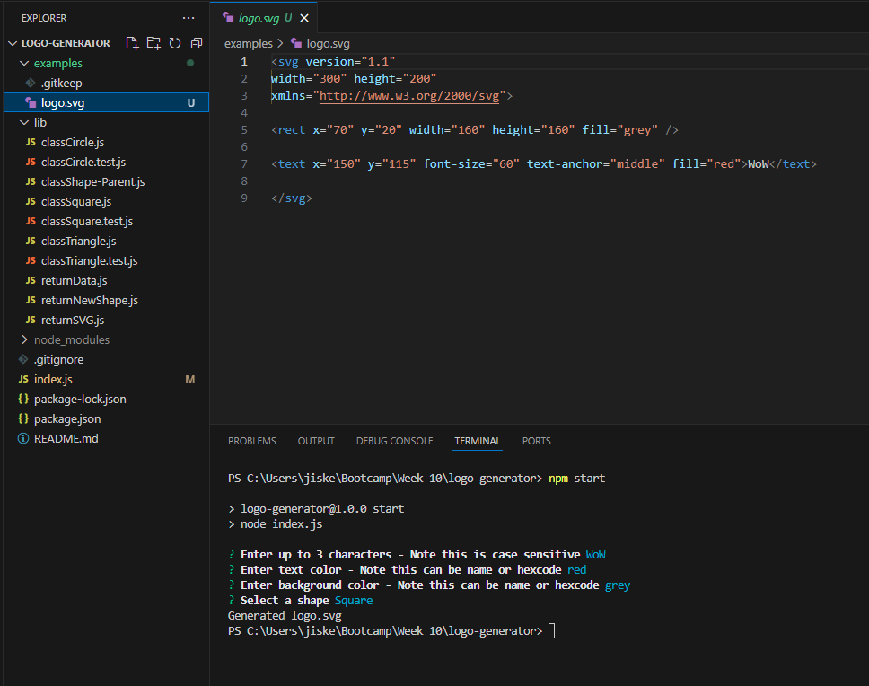

# Logo Generator

## The Project

This project was designed for a user to be able to input prompts with information regarding characters, colours and shape of the logo they wish to generate. A svg file with properties reflecting the characteristics they input will then be automatically generated. Other features include:

- Functionality to generate three different shapes.
- Able to use either color keywords or hexadecimal codes.
- Test set up to ensure correct functionality of components

## Link & Contents

- [Installation](#installation)
- [Usage](#usage)
- [Future Development](#future-development)
- [Credits](#credits)
- [Questions and Feedback](#questions-and-feedback)
- [License](#license)

## Image

## Installation

To install the generator all you need to do is follow these steps:

- Clone or fork the repository to your local machine.
- Open the folder in the console and run "npm i" to install dependencies.

## Usage

Following on from installation all you need to do to use the generator is:

- Enter either "npm start" or "node index.js" to initiate the generator.
- Enter all input information.
- Navigate to the examples folder to locate your new logo.
- Open the file in browser to view.
- Move the logo to the relevant folder of the required repository or any other destination you wish.

[Or follow this video tutorial]()

## Future Development

Future development ideas include:

- Adding additional shapes.
- Adding the ability to alter logo size.
- Changing text positioning or fonts for different shapes.

## Credits

Project set by edX/Monash University.Made use of the Xpert learning assistant, AskBcs and our instructor with troubleshooting issues.

Information on SVG files is from https://developer.mozilla.org/en-US/docs/Web/SVG

Screencastify for the demonstration video.

## Questions and Feedback

If you find any issues or have contributions or feedback you can do so by opening an [issue](https://github.com/Jiske-N/logo-generator/issues) on Github.

## License

None
